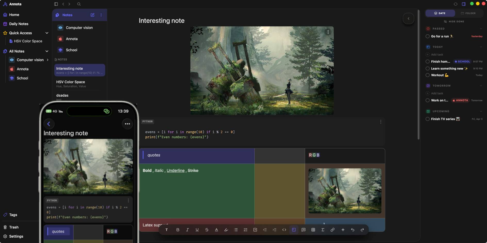

# Annota 📝

A private, local-first mobile note-taking application designed for speed, privacy, and rich text organization.



## ✨ Core Features

-   🏠 **Local-First & Offline**: Everything is stored directly on the device using SQLite. No external cloud dependencies, ensuring maximum privacy and instant access.
-   ✍️ **Desktop-Class Rich Text**: Full TipTap integration providing advanced formatting, tables, and media support within a mobile-optimized interface.
-   📁 **Hierarchical Organization**: A flexible folder system allowing for deep nesting and structured note management.
-   🧷 **Smart File Handling**: Automatic double hashing and deduplication. Files are stored locally, Images resized for performance, and referenced via persistent IDs.
-   ⚡ **Aggressive Caching**: Uses Zustand for a dual-layer state management system—fetching from the database while keeping everything in-memory for zero-latency interactions.
- 🌐 **Server**:(Optional) Supabase for sync and backup w/ end to end encryption (client side) with auto cleanup to minimize storage.

## 🛠 Tech Stack

-   **Frontend**: React Native + Expo (Mobile) , Tauri (Desktop)
-   **Editor**: TipTap + Extensions.
-   **State**: Zustand (Store + Persistence).
-   **Database**: SQLite via Drizzle ORM.
-   **Storage**: Local file system for media.
-   **Backend**: Supabase (Optional)

## 

## Environment Variables

To run Annota, you will need to add the following environment variables to your mobile .env and desktop .env relatively **(unless fully offline)** :

`EXPO_PUBLIC_SUPABASE_KEY`

`EXPO_PUBLIC_SUPABASE_UR`

`VITE_SUPABASE_URL`

`VITE_SUPABASE_KEY`


## Run Locally

Annota is built with a local-first architecture. You can clone the repository and run it locally with minimal effort and knowledge—no server is strictly required for the core experience.

> [!NOTE]
> While a Supabase setup is required for cross-device synchronization and backups, detailed initialization instructions and automated setup scripts are coming soon. For now, you can easily get it working in offline mode but it will require some changes to disable supabase in the code.

### 1. Clone the project

```bash
  git clone https://github.com/iLiranS/Annota
```

### 2. Install dependencies

```bash
  pnpm install
```

### 3. Start the application

Navigate to the respective app directory and run:

**Mobile:**
```bash
  cd apps/mobile
  pnpm start
```

**Desktop:**
```bash
  cd apps/desktop
  pnpm tauri dev
```


## Contributing

Contributions are always welcome!

We currently looking for active testers - especially for Windows / Android compatibility, and further improvements to the systems.

