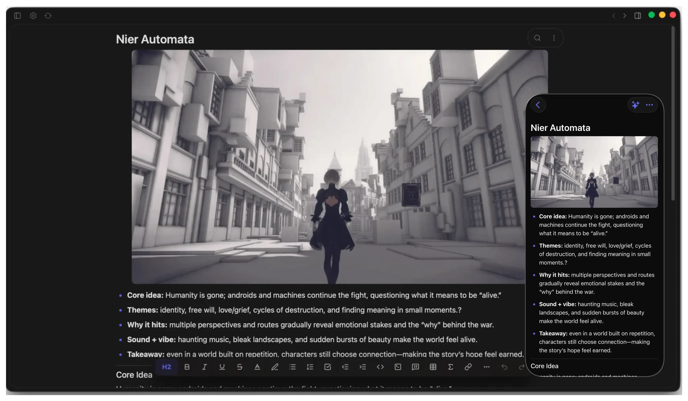

# Annota 📝

A private, local-first mobile note-taking application designed for speed, privacy, and rich text organization.



## ✨ Core Features

- ✍️ **Rich Editor & / Commands**: Markdown support, block-based elements, instant slash commands, and seamless layout. Create interactive study flashcards manually or generate them via AI.
- 📁 **Organization & Links**: Organize your workflow with folders, tags, tabs, and backlinks. Link between notes or specific blocks within them.
- 🎨 **Customization**: Personalize your space with accent colors, custom editor fonts, and more.
- 🤖 **AI Assistant**: Leverage the power of the AI chatbot and quick in-editor actions.
- 🖼️ **Image Gallery**: Organize, search, and preview all your media assets in one place.
- 🔒 **E2E Encrypted Syncing**: Keep your notes up to date across all devices automatically. Fully end-to-end encrypted on the device and on the server—the server sees nothing.
- 📜 **Version History**: Easily track changes, restore, or view older note versions.
- 📤 **Import / Export**: Import or export to Markdown, HTML, and PDF, or publish notes online as shareable links (Pro).
- 🏠 **Local-First & Offline**: SQLite-backed on-device database ensuring maximum privacy and instant access without any cloud dependency.

## 🛠 Tech Stack

- **Mobile Client**: Expo & React Native, SQLite (`expo-sqlite`) via Drizzle ORM, state management via Zustand, and Secure Store. See [apps/mobile/package.json](./apps/mobile/package.json).
- **Desktop Client**: Tauri, React, Vite, Tailwind CSS, Radix UI. See [apps/desktop/package.json](./apps/desktop/package.json).
- **Editor Core**: Custom TipTap-based block editor, extended with KaTeX math, Mermaid diagrams, syntax highlighting (lowlight), tables, and GFM markdown conversion (Turndown/Marked). See [packages/editor-core/package.json](./packages/editor-core/package.json).
- **Backend (Optional)**: Supabase for end-to-end encrypted cloud synchronization and sharing.


## Environment Variables

To run Annota, you will need to add the following environment variables to your mobile .env and desktop .env relatively **(unless fully offline)** :


## ☁️ Supabase Setup
If you are only interested in local mode, you can skip this section, but make sure to set the `VITE_ENABLE_CLOUD` and `EXPO_PUBLIC_ENABLE_CLOUD` environment variables to `false`. if you do decide to use cloud you need to have those in .env (of desktop / mobile relatively)
`EXPO_PUBLIC_SUPABASE_KEY`
`EXPO_PUBLIC_SUPABASE_UR`
`VITE_SUPABASE_URL`
`VITE_SUPABASE_KEY`

To enable sync and backup features, follow these setup guides in order:

1. [Initial Setup](./docs/Supabase_setup/1__initial_setup.md)
2. [Required Tables](./docs/Supabase_setup/2__required_tables.md)
3. [Row Level Security](./docs/Supabase_setup/3__rls___row_level_security.md)
4. [Database Functions & Triggers](./docs/Supabase_setup/4__database_functions___triggers.md)
5. [Edge Functions](./docs/Supabase_setup/5__edge_functions.md)
6. [Roles & Indexes](./docs/Supabase_setup/6__roles___indexes.md)
7. [Storage Buckets](./docs/Supabase_setup/7__storage_buckets.md)
8. [Scheduled Tasks & Cron Jobs](./docs/Supabase_setup/8__scheduled_tasks__cron_jobs_.md)
9. [Published Notes](./docs/Supabase_setup/9__published_notes.md) (optional)


## Run Locally

Annota is built with a local-first architecture. You can clone the repository and run it locally with minimal effort and knowledge—no server is strictly required for the core experience.


### 1. Clone the project

```bash
  git clone https://github.com/iLiranS/Annota
```

### 2. Install dependencies

```bash
  pnpm install
```

### 3. Start the application

Navigate to the respective app directory and run:

**Mobile:**
```bash
  cd apps/mobile
  pnpm start
```

**Desktop:**
```bash
  cd apps/desktop
  pnpm tauri dev
```


## Contributing

Contributions are always welcome!

We currently looking for active testers - especially for Windows / Android compatibility, and further improvements to the systems.

